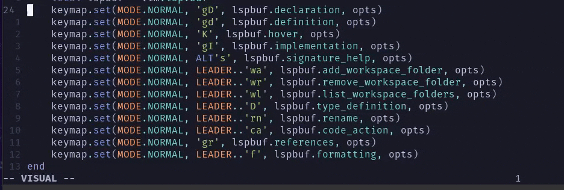

# Adalign Neovim



Adalign adds a simple align by regexp command :Align for Neovim.

This started as a quick user command in my config but I've since improved upon it to be more complete. Thus the birth of a little plugin, Adalign.

Adalign uses the new Neovim 0.8 user command preview functionality to support previews (like :s and /). I recommend Neovim >=0.8.1 (or nightly).

## Installation
Packer example:
```lua
    use 'grassdne/adalign-neovim'
```

## Usage
```vim
:help adalign-neovim
```


